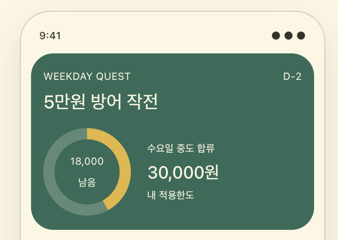

# 자린고비

> 혼자 참는 절약에서, 함께 완주하는 지출 챌린지로.

자린고비는 친구·연인·동료와 기간과 기준 금액을 정하고, 사진으로 지출을 기록하며 서로 응원하는 소셜 지출 챌린지 앱입니다.

대한민국 공휴일과 참여 시점을 반영해 사람마다 실제로 지켜야 할 한도를 자동으로 계산합니다. 같은 방에 늦게 합류해도 남은 유효 일수만큼 공정하게 도전할 수 있습니다.

## 이런 경험을 만듭니다

- **함께 시작하기** — 6자리 코드로 비공개 챌린지에 초대하고 참여합니다.
- **공정한 한도 계산** — 공휴일과 중도 합류일을 반영해 개인별 적용 한도를 계산합니다.
- **사진으로 지출 기록하기** — 챌린지 지출에 사진을 남기고 해당 지출에서 바로 대화합니다.
- **가볍게 경쟁하기** — 남은 금액이 가장 큰 참여자에게 왕관을 표시합니다.
- **끝까지 정리하기** — 종료 후 보정·정산 시간을 거쳐 결과를 읽기 전용 기록으로 보관합니다.

## 핵심 정책

- 챌린지 생성 후 기간과 기준 금액은 변경할 수 없습니다.
- 대한민국 공휴일은 선택일과 적용 한도에서 제외합니다.
- 진행 중 합류자는 합류일부터 남은 유효 일수만 적용합니다.
- 종료 후 12시간 동안 누락 지출을 보완하고, 이후 36시간 동안 결과를 정산합니다.
- 수입은 기록하지 않으며 사용자가 직접 등록한 지출만 집계합니다.

## 현재 구현 범위

- 이메일 회원가입·로그인·비밀번호 복구
- 챌린지 생성·참여·초대 코드
- 개인별 적용 한도와 진행률
- 개인 및 챌린지 지출 기록
- 사진 첨부, 댓글과 1단계 답글
- 오프라인 변경 큐와 재동기화
- 지난 챌린지 검색·열람
- 알림 및 프로필 설정

## 프로젝트 문서

- [제품 기획서](docs/01-product-plan.md)
- [서비스 운영 정책](docs/02-product-policy.md)
- [구현 체크리스트](docs/03-implementation-checklist.md)
- [Supabase 계약](supabase/README.md)

## 기술 구성

Expo 57 · React Native · TypeScript · Expo Router · Supabase · AsyncStorage

## 프로젝트 상태

현재 MVP 기능과 데이터 계약을 구현하고 실제 기기 동작 및 출시 준비 항목을 검증하고 있습니다.
