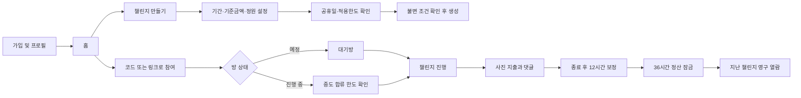

# 자린고비 제품 기획서

- 문서 상태: Draft v0.2
- 작성일: 2026-07-10
- 대상: Android / iOS
- 현재 범위: 제품 기획 및 MVP 정의
- 반영 기준: 2026-07-10 사용자 확정사항

## 1. 제품 한 줄 정의

정해진 기간과 기준금액으로 방을 만들고, 대한민국 공휴일과 합류일을 반영해 자동 계산된 각자의 적용한도 안에서 사진 지출과 실시간 피드백을 나누는 초대형 소셜 지출 챌린지 앱.

예: 월요일부터 금요일까지 기준금액 50,000원인 방에 수요일 합류 시 적용한도는 30,000원이다. 해당 주 목요일이 공휴일이면 수요일 합류자의 적용한도는 20,000원이다.

이 앱의 `지출 제한`은 실제 결제를 막는 기능이 아니다. 모든 진행률과 결과는 **사용자가 직접 등록한 기록 기준**이며 사진도 소비의 진위를 보증하는 증빙이 아니라 기록과 대화를 돕는 수단이다.

## 2. 해결하려는 문제

- 혼자 세운 지출 목표는 쉽게 잊히고 지속 동기가 약하다.
- 일반 지출 기록 앱은 집계에는 강하지만 함께 응원하고 피드백하기 어렵다.
- 단체 채팅은 반응은 빠르지만 어느 지출에 대한 대화인지 맥락이 쉽게 사라진다.
- 진행 중 합류하거나 기간에 공휴일이 있으면 동일한 총금액을 적용하기 어렵다.

이 앱은 `참여자별 자동 계산 한도 + 사진 지출 기록 + 지출별 대화 + 지난 챌린지 보관`을 하나의 방에 묶는다.

## 3. 확정 제품 원칙

1. **방 조건은 생성 즉시 고정**: 기간과 기준금액은 대기 중에도 수정할 수 없다.
2. **각자의 적용한도는 자동 계산**: 공휴일과 합류일에 따라 실제 한도가 달라질 수 있다.
3. **지출만 기록**: 수입 입력과 수입 기반 잔액 기능은 제공하지 않는다.
4. **챌린지 기록만 공유**: 개인 지출 기록 중 방에 연결한 지출만 방 구성원에게 보인다.
5. **사진으로 기록의 재미 강화**: 챌린지 지출에는 사진 1장을 반드시 첨부한다.
6. **대화 맥락 유지**: 지출마다 채팅형 댓글 스레드와 1단계 인용 답글을 제공한다.
7. **가벼운 경쟁 표시**: 전체 순위표는 두지 않되 남은 금액이 가장 큰 활성 멤버에게 `👑`을 표시한다.
8. **완료 기록은 자동 보관**: 정산이 끝난 방은 읽기 전용 지난 기록으로 계속 열람할 수 있다.

## 4. 주요 사용자와 시나리오

### 4.1 1차 타깃

- 짧은 기간 동안 생활비를 줄이고 싶은 친구 또는 연인
- 점심비, 커피비 등 소규모 절약 챌린지를 함께하려는 동료
- 소비 습관을 사진으로 남기며 서로 응원하고 싶은 소그룹

### 4.2 대표 시나리오

- 월~금 5일 동안 기준금액 50,000원 이하로 쓰기
- 공휴일 하루가 포함된 평일 챌린지에서 적용한도 40,000원으로 도전하기
- 진행 중인 5일 챌린지에 수요일 합류해 적용한도 30,000원으로 참여하기
- 종료 후 토요일 오전까지 누락 지출을 보완하고 월요일부터 지난 기록으로 확인하기

## 5. 핵심 용어

| 용어 | 의미 |
|---|---|
| 챌린지 방 | 기간, 기준금액, 공휴일 스냅샷, 참여자가 묶인 비공개 공간 |
| 방장 | 방을 만들고 정원·초대·멤버를 관리하는 사람 |
| 참여 코드/초대 링크 | 예정 또는 진행 중인 방에 들어가기 위한 초대 수단 |
| 정원 | 방 생성 시 정하고 방장이 늘릴 수 있는 참여 가능 인원 |
| 선택일 | 방장이 기간 또는 프리셋으로 선택한 모든 챌린지 날짜 |
| 제외 공휴일 | 방 생성 당시 확인된 대한민국 공휴일 중 선택일에 포함된 날짜 |
| 유효 챌린지 일 | 선택일에서 제외 공휴일을 뺀 날짜 |
| 기준금액 | 방장이 생성 시 입력하고 즉시 고정되는 전체 기간 기준 금액 |
| 적용한도 | 기준금액에 공휴일과 참여자의 합류일을 비례 반영한 실제 개인 한도 |
| 남은 금액 | 적용한도에서 유효 지출 합계를 뺀 금액 |
| 보정 | 챌린지 종료 후 12시간 동안 기간 내 지출을 보완하는 상태 |
| 정산 | 보정 종료 후 36시간 동안 지출 입력·수정·삭제를 잠그고 결과를 확정하는 상태 |
| 지난 챌린지 | 정산 완료 후 읽기 전용으로 보관되는 방과 기록 |

## 6. MVP 목표와 범위

### 6.1 반드시 제공할 기능(P0)

#### 계정과 프로필

- 지속 가능한 사용자 계정
- 닉네임과 프로필 이미지
- 알림 설정

#### 내 지출 기록

- 지출 금액, 카테고리, 발생 일시, 메모 입력
- 일·기간별 지출 합계
- 챌린지 지출을 내 기록과 방 피드에 중복 없이 한 번 저장
- 수입 입력 기능 없음

#### 챌린지 생성과 초대

- 챌린지명, 기간, 기준금액, 최초 정원 입력
- 시작일·종료일 또는 시작일·기간 방식
- 빠른 선택: 오늘, 다음 평일(월~금), 7일, 직접 선택
- 대한민국 공휴일 자동 제외와 예상 적용한도 미리보기
- 생성 전 `기간·기준금액 수정 불가` 확인
- 6자리 참여 코드와 초대 링크 생성·복사·공유
- 방장이 정원을 늘려 추가 초대
- 예정 및 진행 중인 방에 정원 내 참여

#### 자동 한도 계산

- 시작 전 참여자는 공휴일을 반영한 전체 유효일 한도 적용
- 진행 중 참여자는 합류일을 포함한 남은 유효일 한도 적용
- 기준금액, 전체 선택일, 제외 공휴일, 합류일, 계산 결과 표시
- 원 단위 미만 내림

#### 챌린지 진행

- 남은 기간, 적용한도, 사용 금액, 남은 금액, 진행률
- 참여자별 합류일·적용한도·진행률
- 남은 금액 1위 활성 멤버의 닉네임 앞 `👑`
- 사진이 포함된 지출 피드
- 보정 마감 전 지출 등록·수정·삭제
- 개인 달성 여부와 전체 완주 현황

#### 사진과 실시간 피드백

- 챌린지 지출마다 사진 정확히 1장
- 지출 상세 화면의 채팅형 댓글 UI
- 댓글 실시간 수신
- 댓글 길게 누르기 → 답글 대상 미리보기 → 답글 전송
- 답글 취소, 전송 실패 재시도, 새 댓글 알림

#### 보정·정산·기록 보관

- 종료 경계 후 12시간 동안 기간 내 지출 입력·수정·삭제
- 이후 36시간 동안 지출 변경 잠금과 정산 상태 표시
- 정산 완료 후 읽기 전용 `지난 챌린지` 자동 이동
- 이전 지출, 사진, 댓글, 참여자별 적용한도, 공휴일, 최종 결과 열람
- 연도·월별 그룹과 챌린지명 검색

### 6.2 출시 후 확장(P1)

- 여러 장의 사진, 영수증 OCR, 금액 자동 인식
- 하루 단위 `오늘 무지출` 확인
- 이모지 반응과 응원 스티커
- 반복 챌린지와 템플릿
- 여러 통화와 국가별 공휴일
- 공동 예산형 챌린지
- 친구 목록과 재초대
- 소비 리포트와 회고 카드
- 데이터 내보내기

### 6.3 이번 범위에서 제외

- 수입 입력과 수입 기반 잔액 관리
- 은행·카드 자동 연동
- 송금 또는 결제
- 공개 방 검색과 불특정 사용자 매칭
- 숫자 순위표, 벌금, 현금성 보상
- 1:1 개인 메시지와 방 전체 일반 채팅
- 사진이 실제 구매를 증명하는지 자동 판정

## 7. 핵심 사용자 흐름

### 7.1 방장 흐름

1. 챌린지 이름, 기간, 기준금액, 최초 정원을 입력한다.
2. 제외 공휴일과 시작 전 참여자의 예상 적용한도를 확인한다.
3. 기간과 기준금액을 다시 바꿀 수 없다는 안내에 동의하고 방을 만든다.
4. 코드 또는 초대 링크를 공유한다.
5. 인원을 더 받고 싶으면 서비스 최대 정원 안에서 정원을 늘린다.
6. 진행 중 새 멤버가 합류하면 해당 멤버의 계산 결과를 함께 확인한다.
7. 정산 완료 후 지난 챌린지에서 최종 결과와 전체 기록을 본다.

기간이나 기준금액을 잘못 입력한 경우 시작 전에 방을 삭제하고 새로 만들어야 한다. 한 건 이상의 공유 지출이 생긴 뒤에는 방장이 다른 참여자의 기록을 일괄 삭제할 수 없다.

### 7.2 참여자 흐름

1. 참여 코드 또는 링크로 방 미리보기를 연다.
2. 기간, 기준금액, 공휴일 제외일, 현재 정원, 기존 기록 공개 범위를 확인한다.
3. 진행 중 방이면 합류일과 본인의 적용한도 계산 내역을 먼저 확인한다.
4. 참여를 확정하면 기존 방 피드를 볼 수 있고 합류 이후 지출을 기록한다.
5. 다른 참여자의 지출에 댓글 또는 인용 답글을 남긴다.
6. 본인의 적용한도와 남은 금액을 보며 목표를 조정한다.
7. 완료 후 지난 챌린지에서 읽기 전용 기록을 다시 본다.

## 8. 화면 구조(IA)

### 8.1 전역 내비게이션

MVP 하단 탭은 3개로 구성한다.

1. **홈**: 예정·진행·보정·정산 챌린지, 만들기, 코드 참여, 지난 챌린지
2. **내 지출**: 캘린더/목록, 기간별 지출 합계, 기록 추가
3. **내 정보**: 프로필, 알림, 차단·신고 내역, 이용 정책, 탈퇴

진행 또는 보정 중인 챌린지가 있으면 주요 화면에 공통 `+ 지출` 버튼을 둔다. 알림함은 홈 상단 종 아이콘으로 진입한다.

### 8.2 화면 목록

| ID | 화면 | 핵심 역할 |
|---|---|---|
| ONB-01 | 가입/로그인 | 계정 생성과 복구 가능한 로그인 |
| ONB-02 | 프로필 설정 | 닉네임과 프로필 이미지 설정 |
| HOM-01 | 홈 | 상태별 챌린지와 지난 기록 진입 |
| CHL-01 | 챌린지 만들기 | 기간, 기준금액, 정원, 공휴일, 불변 조건 확인 |
| CHL-02 | 코드/링크 참여 | 방 정보와 개인 적용한도 확인 후 참여 |
| CHL-03 | 대기방 | 고정 조건, 참여자, 코드, 정원 관리 |
| CHL-04 | 챌린지 방 | 진행률, `👑`, 참여자 현황, 지출 피드 |
| CHL-05 | 참여자 현황 | 합류일, 적용한도, 사용·남은 금액 |
| EXP-01 | 내 지출 | 기간별 지출과 지출 합계 |
| EXP-02 | 지출 등록/수정 | 금액, 사진, 고정 카테고리, 일시, 메모 |
| FED-01 | 지출 상세/대화 | 지출 카드와 채팅형 댓글·답글 |
| SET-01 | 보정/정산 | 남은 보정 시간, 잠금, 결과 처리 상태 |
| HIS-01 | 지난 챌린지 | 연도·월별 완료 방 목록과 검색 |
| HIS-02 | 지난 기록 상세 | 규칙·멤버·지출·댓글·최종 결과 열람 |
| NTF-01 | 알림 | 댓글, 답글, 합류, 상태 전환 알림 |
| CFG-01 | 설정/안전 | 공개 범위, 알림, 신고, 차단, 탈퇴 |

## 9. 핵심 화면 상세

### 9.1 챌린지 만들기

입력 순서:

1. 챌린지 이름
2. 기간
3. 기준금액
4. 최초 정원
5. 공휴일 제외 결과와 예상 적용한도
6. 불변 조건 확인 후 만들기

예상 계산 카드에는 다음을 함께 보여준다.

- `선택 5일`
- `대한민국 공휴일 1일 제외`
- `유효 챌린지 4일`
- `기준금액 50,000원`
- `시작 전 참여자 적용한도 40,000원`

최종 확인 문구:

> 방을 만들면 기간과 기준금액을 변경할 수 없습니다. 잘못 입력했다면 시작 전에 방을 삭제하고 새 방을 만들어야 합니다.

### 9.2 초대와 중도 합류

- 방장은 서비스 최대값 안에서 정원을 늘릴 수 있다.
- 참여 코드와 초대 링크는 챌린지 종료 경계까지 유효하다.
- 정원에 여유가 있으면 진행 중에도 합류할 수 있다.
- 합류 확인 화면은 기존 피드 열람 범위와 개인 적용한도를 먼저 보여준다.

예시:

> 현재 진행 중인 방입니다. 수요일에 합류하면 전체 5일 중 남은 유효일 3일이 적용되어 한도는 30,000원입니다.

중도 합류자에게는 `늦게 합류` 배지를 표시한다. 합류일은 한도 일수에는 포함하지만 합류 확정 시각보다 앞선 지출은 챌린지에 소급 등록할 수 없다.

### 9.3 챌린지 방

상단 요약:

- `기준금액 50,000원`
- `내 적용한도 30,000원 · 수요일 합류`
- `12,000원 사용 / 18,000원 남음`
- 남은 기간과 진행률

참여자 카드, 피드, 댓글에서 남은 금액이 가장 큰 활성 멤버의 닉네임을 `👑 민지`처럼 표시한다. 동률이면 공동 1위 모두에게 표시한다. 지출 등록·수정·삭제, 합류·이탈이 확정될 때마다 다시 계산한다.

### 9.4 지출 등록

- 수입/지출 전환 없이 지출만 입력한다.
- 챌린지 방에서 진입하면 해당 방이 자동 선택된다.
- 챌린지 지출은 사진이 없으면 완료 버튼을 활성화하지 않는다.
- 사진은 직접 촬영하거나 앨범에서 선택하고 저장 전 미리보기·교체를 제공한다.
- 입력 순서는 사진 → 금액 → 카테고리 → 메모 → 발생 일시다.
- 카테고리는 `점심`, `커피`, `간식`, `저녁`, `필수품`, `사치품`만 제공한다.
- 중도 합류자는 합류 확정 시각 전의 지출을 챌린지에 연결할 수 없다.
- 보정 마감 이후에는 지출 작성 화면에 진입할 수 없다.

### 9.5 지출 상세와 채팅형 댓글

- 다른 사람 댓글은 왼쪽, 내 댓글은 오른쪽 말풍선으로 표시한다.
- 댓글을 길게 누르면 답글, 복사, 신고, 본인 댓글 수정·삭제 메뉴를 보여준다.
- 답글은 입력창 위의 읽기 전용 인용 칩으로 표시한다.
- 답글 깊이는 1단계이며 인용 부분을 누르면 원문 위치로 이동한다.
- 새 지출·댓글은 정상 네트워크에서 수 초 안에 반영하고 백그라운드에서는 푸시로 알린다.
- 타이핑 표시, 온라인 상태, 메시지별 읽음 확인은 제외한다.

### 9.6 보정과 정산

종료일 다음 날 00:00을 종료 경계 `E`로 정의한다.

| 구간 | 상태 | 지출 | 댓글 |
|---|---|---|---|
| `E ≤ t < E+12h` | 보정 | 기간 내 지출 입력·수정·삭제·사진 재업로드 | 작성 가능 |
| `E+12h ≤ t < E+48h` | 정산 | 조회만 가능 | 작성 및 5분 내 수정 가능 |
| `t ≥ E+48h` | 완료/보관 | 읽기 전용 | 읽기 전용 |

월~금 챌린지는 토요일 00:00에 보정이 시작되고 토요일 12:00에 지출 변경이 잠긴다. 토요일 12:00부터 일요일 24:00까지 정산한 뒤 월요일 00:00에 완료된다.

### 9.7 지난 챌린지 보관

완료 방은 복제하지 않고 같은 방을 `ARCHIVED` 상태로 전환한다. 자동 만료일은 두지 않으며 서비스 운영 중 계속 열람할 수 있다.

지난 기록 상세에 보관할 항목:

- 방 이름, 기간, 기준금액, 선택일, 제외 공휴일
- 참여자별 합류일, 적용한도 계산 근거, 사용·남은 금액, 달성 여부
- 최종 왕관 보유자
- 지출 금액·카테고리·일시·사진·메모
- 지출별 댓글·답글과 수정·삭제 표식
- 완료 시각과 결과 스냅샷

목록은 연도·월별로 묶고 챌린지명 검색, 참여 여부, 달성 여부 필터를 제공한다. 사진은 썸네일을 먼저 불러오고 상세 진입 시 원본을 지연 로딩한다.

각 사용자는 완료 방을 `내 목록에서 숨기기` 할 수 있지만 공유 기록은 삭제되지 않는다. 한 건 이상의 공유 기록이 생긴 방은 방장이 일괄 삭제하지 못한다. 사진·메모·댓글에 대한 개별 삭제 요청은 내용 대신 `삭제된 콘텐츠` 표식을 남겨 합계와 대화 구조를 보존한다.

## 10. 계산과 표시 원칙

### 10.1 지출 합계

- 지출 합계 = 조회 기간의 유효한 지출 금액 합
- 챌린지 사용 금액 = 해당 방과 유효일에 연결된 유효 지출 합

### 10.2 적용한도

정의:

- `B` = 방 생성 시 입력한 기준금액
- `N` = 공휴일 제외 전 전체 선택일 수
- `R_i` = 참여자 i의 합류일 이상인 선택일 중 대한민국 공휴일이 아닌 날짜 수

계산식:

- 참여자 적용한도 `L_i = floor(B × R_i ÷ N)`
- 남은 금액 `M_i = L_i - 유효 지출 합계`
- 진행률 `= 유효 지출 합계 ÷ L_i × 100`

원 단위 미만은 내림한다. 공휴일은 분자 `R_i`에서 제외하지만 전체 선택일인 분모 `N`에는 포함하므로 기준금액 자체는 바뀌지 않고 적용한도만 줄어든다.

예시:

| 조건 | 계산 | 적용한도 |
|---|---:|---:|
| 5일·50,000원, 공휴일 없음, 시작 전 합류 | 50,000 × 5 ÷ 5 | 50,000원 |
| 5일·50,000원, 공휴일 1일, 시작 전 합류 | 50,000 × 4 ÷ 5 | 40,000원 |
| 5일·50,000원, 공휴일 없음, 수요일 합류 | 50,000 × 3 ÷ 5 | 30,000원 |
| 수요일 합류 후 남은 3일 중 공휴일 1일 | 50,000 × 2 ÷ 5 | 20,000원 |

### 10.3 공휴일 기준

- MVP는 대한민국 공휴일과 대체공휴일을 제외한다.
- 방 생성 시점에 알려진 공휴일 목록과 데이터 버전을 방에 스냅샷으로 저장한다.
- 생성 후 임시공휴일이 새로 지정돼도 기존 방의 계산은 바꾸지 않는다.
- 선택일이 모두 공휴일이면 방을 생성할 수 없다.

### 10.4 왕관

- 후보는 현재 활성 상태인 참여자다.
- `남은 금액 M_i`의 실제 원화 값이 가장 큰 참여자에게 표시한다. 음수는 절댓값으로 바꾸지 않는다.
- 동률이면 동률자 모두에게 공동 왕관을 표시한다.
- 진행·보정 중에는 임시 왕관, 정산 잠금 시점부터는 잠정 고정, 완료 시 최종 왕관으로 보관한다.
- 중도 이탈·강제 퇴장 사용자는 후보에서 제외한다.
- 왕관은 예산 달성 여부와 별개이며 전원이 초과해도 남은 금액이 가장 큰 활성 멤버에게 표시한다.

## 11. 주요 상태와 예외 UX

| 상황 | 사용자 경험 |
|---|---|
| 유효하지 않은 코드 | 코드 재확인 안내와 입력값 유지 |
| 진행 중이며 정원 여유 있음 | 적용한도 확인 후 합류 |
| 정원 마감 | 참여 불가와 방장 문의 안내 |
| 종료 경계 이후 | 신규 합류 불가 |
| 공휴일로 적용한도 감소 | 제외 날짜와 계산식을 함께 표시 |
| 합류 가능한 유효일 0일 | 참여 불가 |
| 사진 업로드 실패 | 로컬 임시 저장, 재시도, 미동기화 표시 |
| 보정 마감 시 업로드 미완료 | 실패·결과 제외로 종결 |
| 한도 초과 | 초과 금액과 100% 초과 진행률 표시, 기록은 계속 가능 |
| 왕관 동률 | 공동 왕관 표시 |
| 정산 중 | 지출 입력·수정·삭제 버튼 숨김, 잠정 결과 표시 |
| 완료 | 지난 챌린지에서 읽기 전용 열람 |
| 삭제된 콘텐츠 | 원문 대신 삭제 표식과 합계·답글 구조 유지 |

## 12. 알림 초안

- 챌린지 시작 10분 전과 시작 시각
- 새 참여자 합류와 정원 마감
- 내 지출의 새 댓글과 내 댓글에 대한 답글
- 개인 한도 50%, 80%, 100% 도달
- 사진 업로드 또는 동기화 실패
- 종료 경계 `E`: 12시간 보정 시작
- `E+10h`: 지출 보정 마감 2시간 전
- `E+12h`: 지출 잠금과 정산 시작
- `E+48h`: 결과 확정과 지난 챌린지 이동

한도와 왕관 변경은 다른 참여자에게 별도 푸시하지 않는다. 사용자는 전체·방별 알림을 끌 수 있다.

## 13. 성공 지표

### 북극성 지표

`주간 유효 챌린지 완료 참여자 수`를 권장한다. 예정 또는 진행 중 합류 후 중도 이탈하지 않고 정산 완료까지 남은 사람을 센다. 예산을 지킨 `개인 달성`과 모든 유효 참여자가 달성한 `전체 완주`는 별도 지표다.

### 핵심 지표

- 방 생성 후 첫 초대 참여 전환율
- 진행 중 합류 화면의 참여 완료율
- 참여자당 사진 지출 수
- 댓글 또는 답글이 하나 이상 달린 지출 비율
- 보정 시간 내 누락 지출 등록률
- 완료 방 재열람률
- 완료 후 다음 챌린지 재참여율

### 품질 지표

- 공휴일·중도 합류 한도 계산 오류율
- 지출·댓글 등록 성공률
- 사진 업로드 실패율
- 실시간 메시지 수신 지연
- 중복 집계율
- 신고율과 방 이탈률

## 14. MVP 완료 조건

- iOS와 Android에서 같은 입력이 같은 계산 결과를 만든다.
- 방 생성 직후 기간과 기준금액을 수정할 수 없다.
- 예정·진행 중 방에 정원 내 참여자를 초대할 수 있다.
- 대한민국 공휴일과 합류일을 반영한 적용한도가 원 단위 내림으로 계산된다.
- 5일·50,000원 방의 수요일 합류자는 공휴일이 없을 때 30,000원을 적용받는다.
- 카테고리는 점심, 커피, 간식, 저녁, 필수품, 사치품만 보인다.
- 챌린지 지출은 사진 없이 등록할 수 없다.
- 지출이 내 기록과 방 피드에 중복 없이 한 번 반영된다.
- 남은 금액 최대 활성 멤버의 왕관이 실시간으로 재계산되고 동률은 공동 표시된다.
- 댓글을 길게 눌러 특정 댓글에 인용 답글을 달 수 있다.
- 종료 후 12시간 보정, 다음 36시간 정산, 이후 완료 상태로 정확히 전환한다.
- 정산 완료 후 방·사진·댓글·계산 근거·결과를 지난 챌린지에서 계속 열람할 수 있다.
- 오프라인 재전송에서도 금액과 메시지가 중복 생성되지 않는다.

## 15. 권장 출시 순서

1. **내부 알파**: 방 불변 조건, 공휴일·중도 합류 계산, 지출 기록, 사진, 왕관
2. **비공개 베타**: 댓글·답글, 초대 링크, 보정·정산, 지난 기록, 알림, 신고·차단
3. **스토어 MVP**: 접근성, 운영 도구, 약관·개인정보 문서, 장애 대응 검증

## 16. 남은 세부 결정

최신 요청으로 주요 제품 방향은 확정됐다. 개발 전에 아래 운영 세부값만 결정하면 된다.

| 결정 | 현재 권장안 |
|---|---|
| 서비스 최대 정원 | 활성 멤버 10명 |
| 왕관 동률 | 공동 1위 모두 표시 |
| 비례 계산 소수점 | 원 단위 미만 내림 |
| 공휴일 데이터 | 방 생성 시 대한민국 공휴일 스냅샷 고정 |
| 정산 중 댓글 | 허용, 완료 시 읽기 전용 |
| 완료 기록 보관 | 자동 만료 없이 서비스 운영 중 보관 |
| 시작 전 방 삭제 | 공유 지출이 없을 때 방장만 가능 |
| 시작 후 방 처리 | 전체 삭제 불가, 사용자별 목록 숨기기만 가능 |
| 개인정보 삭제 | 본문 제거 후 삭제 표식과 비식별 결과 스냅샷 유지 |
