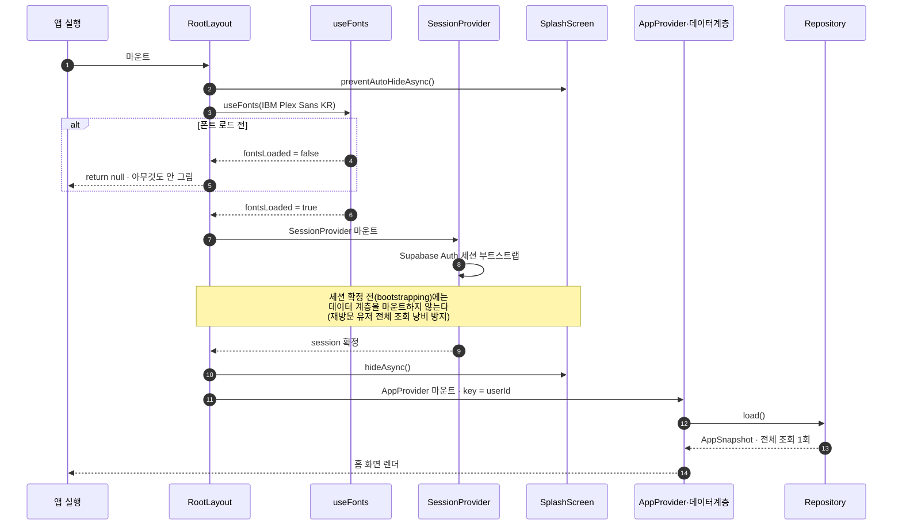
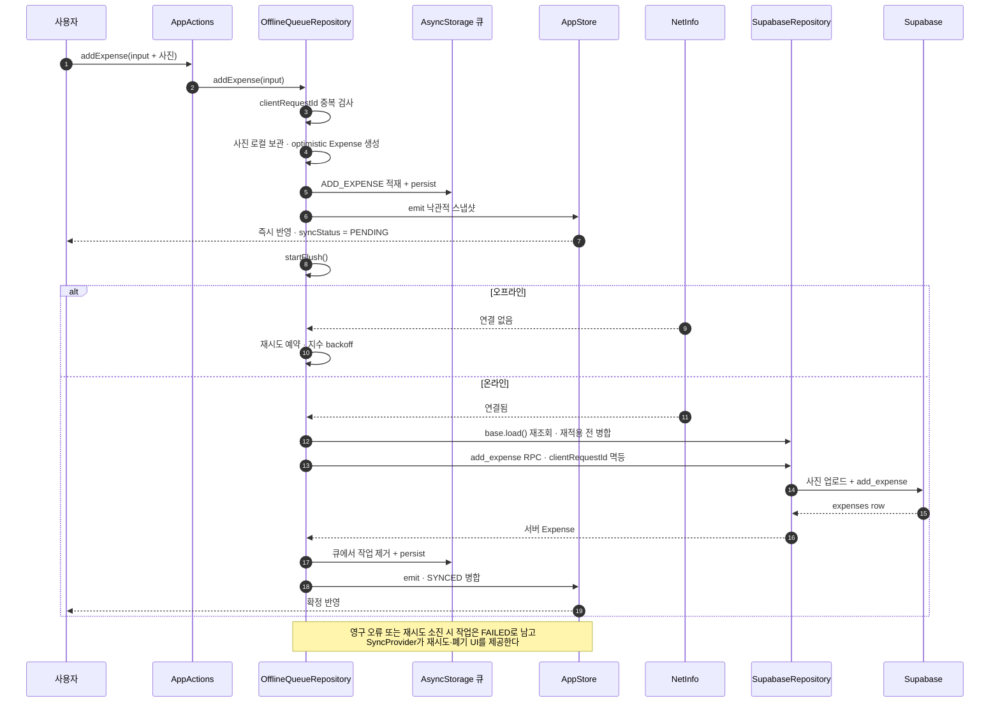
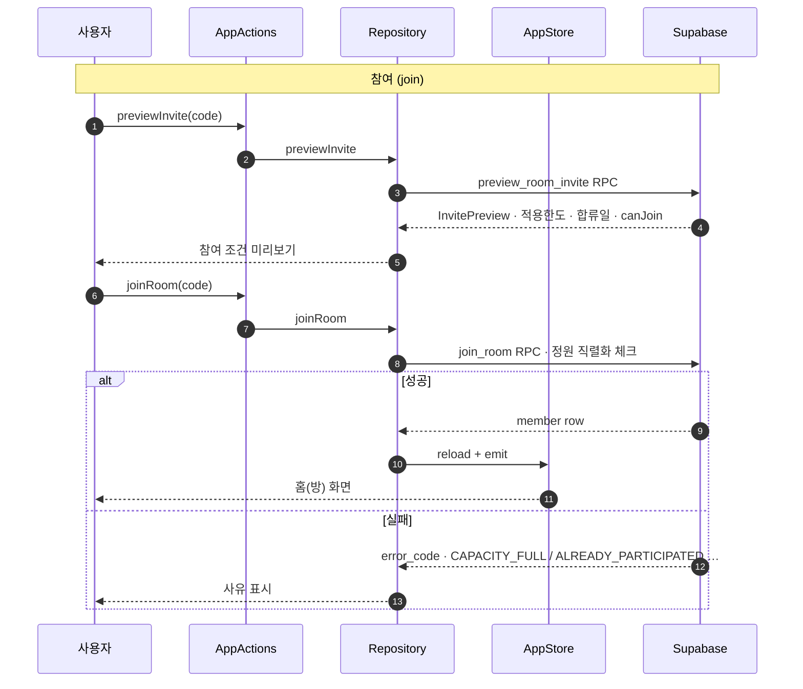
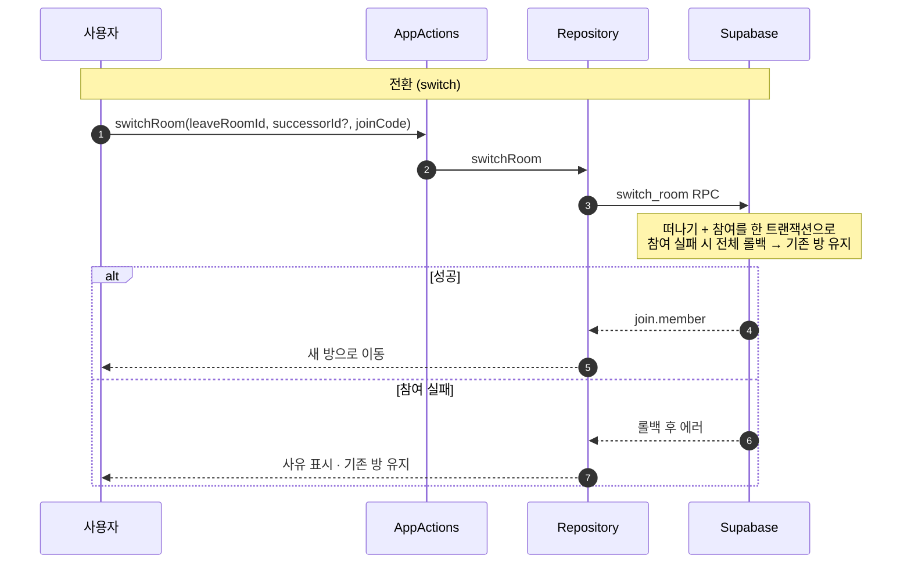
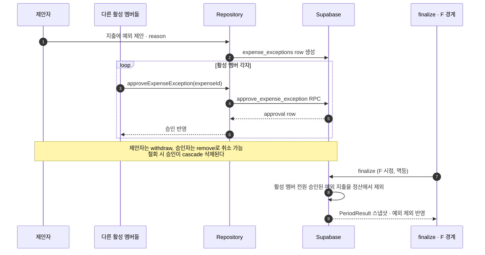

# 자린고비 아키텍처 & 개발자 가이드

- 문서 상태: Living document
- 대상: 이 저장소에서 작업하는 개발자
- 범위: 코드 구조, 계층 설계, 실행/빌드 방법, 핵심 도메인 규칙
- 함께 볼 문서: [제품 기획서](01-product-plan.md) · [운영 정책](02-product-policy.md) · [구현 체크리스트](03-implementation-checklist.md) · [방 모델 재설계](room-model-redesign.md) · [Supabase 계약](../supabase/README.md)

> 이 문서는 "무엇을 만드는가"(기획·정책 문서)와 "코드가 어떻게 생겼는가"(소스) 사이를 잇는 다리다. 제품 규칙의 근거는 기획/정책 문서, DB 계약의 정본은 `supabase/README.md`가 소유한다.

---

## 1. 한눈에 보기

**자린고비**는 친구·연인·동료와 기간과 기준 금액을 정하고, 사진으로 지출을 기록하며 서로 응원하는 소셜 지출 챌린지 앱이다. 대한민국 공휴일과 각자의 합류 시점을 반영해 사람마다 실제 지켜야 할 한도를 자동 계산한다.

| 항목 | 값 |
|---|---|
| 플랫폼 | iOS · Android (Expo, New Architecture) |
| 통화 · 시간대 | KRW · Asia/Seoul (전 계산 고정) |
| 프런트엔드 | Expo 57 · React Native 0.86 · React 19 · TypeScript |
| 라우팅 | Expo Router (파일 기반, typed routes) |
| 백엔드 | Supabase (Postgres + RLS + `SECURITY DEFINER` RPC + Storage) |
| 로컬 저장 | AsyncStorage (오프라인 큐 · 스냅샷 · 설정) |
| 상태 관리 | 커스텀 스토어 + `useSyncExternalStore` (외부 라이브러리 없음) |
| 배포 | EAS Build · EAS Update (OTA) |

### 핵심 도메인 개념

```
Room (방)                     상위 개념. 고정 설정(기준금액·정원) + 초대 + 멤버십 소유
  ├─ RoomMember               방 멤버십(영속). 가입 시 1행, 탈퇴 전까지 유지
  ├─ InviteCode               6자리 방 초대 코드
  └─ Period (주차)            매주 월~금 자동 생성. 자체 S/E/C/F 타임라인
       ├─ PeriodMember        그 주차 참여자 + 주차별 적용한도 (RoomMember에서 전개)
       ├─ Expense             지출 → Period에 연결 (periodId 없으면 개인 지출)
       │    ├─ Comment        지출 댓글 스레드 (1단계 답글)
       │    └─ ExpenseException  예외 제안 → 활성 멤버 전원 승인 시 정산 제외
       └─ PeriodResult        주차별 정산 스냅샷 (지출합·잔액·달성·왕관)

RoomMemberStats               PeriodResult를 room×user로 집계한 누적 통계
```

과거 "챌린지 1개 = 1회성" 모델에서 "방(상위) + 주차별 챌린지(반복)" 모델로 재설계되었다. 배경과 결정 사항은 [room-model-redesign.md](room-model-redesign.md) 참고.

---

## 2. 시작하기

### 요구 사항

- Node.js (LTS) 및 npm
- iOS: Xcode + CocoaPods / Android: Android SDK
- `android/local.properties`에 로컬 Android SDK 경로 필요 (예: `sdk.dir=/Users/<you>/Library/Android/sdk`)

### 설치 & 실행

```bash
npm install
npm start          # Expo dev 서버 (Metro)
npm run ios        # iOS 네이티브 빌드 후 실행
npm run android    # Android 네이티브 빌드 후 실행
npm run web        # 웹(react-native-web)
```

### 환경 변수 (`.env`)

`.env.example`를 복사해 `.env`를 만든다.

| 변수 | 의미 |
|---|---|
| `EXPO_PUBLIC_SUPABASE_URL` | Supabase 프로젝트 URL |
| `EXPO_PUBLIC_SUPABASE_PUBLISHABLE_KEY` | publishable 키 (secret / service_role 절대 금지) |

**런타임 규칙** (`src/data/repository-factory.ts`):

- 앱은 항상 Supabase 모드로 실행한다. 설정이 없으면 명시적으로 에러를 던진다.
- `.env`의 값을 바꾸면 Metro 캐시 때문에 반영이 안 될 수 있으므로 `npx expo start --clear`로 재시작한다.

### QA 게이트

```bash
npm run qa         # typecheck + lint + unit test 일괄
npm run typecheck  # tsc --noEmit
npm run lint       # expo lint (eslint-config-expo)
npm run test:unit  # vitest run
```

도메인 로직과 데이터 계층에 14개의 `*.test.ts` 유닛 테스트가 있다 (한도 계산·기간·권한·오프라인 큐·동기화 등). 코드 변경 시 `npm run qa` 통과를 기준으로 삼는다.

---

## 3. 프로젝트 구조

```
src/
├─ app/                 화면 + 라우팅 (Expo Router, 파일 = 라우트)
│   ├─ _layout.tsx        루트: 폰트·세션·Provider·Stack
│   ├─ (auth)/            로그인 · 비밀번호 재설정
│   ├─ (tabs)/            홈(방) · 지출 · 프로필
│   ├─ room/              방 생성 · 참여 · 나가기(전환)  (모달)
│   ├─ expense/           지출 상세 · 새 지출  (모달)
│   └─ history/           지난 챌린지 목록 · 상세
│
├─ domain/             순수 계산 로직 (React·IO 의존 없음, 테스트하기 쉬움)
│   ├─ types.ts           PeriodPhase, PeriodTimeline(S/E/C/F), 카테고리 등
│   ├─ period.ts          주차 타임라인·평일 캘린더 생성, phase 판정
│   ├─ limits.ts          적용한도·잔액 계산 (BigInt 정밀도)
│   ├─ holidays.ts        한국 공휴일 스냅샷
│   ├─ crown.ts           왕관 선정 (남은 금액 최대, 동률 공동)
│   ├─ permissions.ts     지출/댓글 변경 권한 (phase·작성자·편집창)
│   ├─ invites.ts         초대 미리보기 계산
│   ├─ replies.ts         1단계 답글 규칙
│   └─ week.ts, date-time.ts  ISO 요일·Seoul 시각 유틸
│
├─ data/               데이터 접근 계층 (Repository 패턴)
│   ├─ repository.ts               AppRepository 인터페이스 (계약)
│   ├─ repository-factory.ts       Supabase 구현 조립 (singleton)
│   ├─ supabase-repository.ts      실 백엔드 (RPC 호출)
│   ├─ offline-queue-repository.ts Supabase를 감싸 오프라인 큐 제공
│   ├─ expense-sync.ts             낙관적 반영 ↔ 서버 병합 로직
│   └─ types.ts                    앱 도메인 타입 (Room, Period, Expense …)
│
├─ store/              클라이언트 상태
│   ├─ app-store.ts       스냅샷 보관 + 구조적 공유(structural sharing)
│   ├─ app-indexes.ts     조회 인덱스 (id → 엔티티 등)
│   └─ app-selectors.ts   파생 상태 계산 (홈 화면 뷰모델 등)
│
├─ providers/          React Context (계층 조립)
│   ├─ session-provider.tsx        Supabase Auth 세션
│   ├─ app-provider.tsx            스토어·상태·액션·동기화 조립
│   ├─ app-store-provider.tsx      스토어 주입
│   ├─ app-status-provider.tsx     로드/실행 상태, execute/reportError
│   ├─ app-actions-provider.tsx    쓰기 액션 (지출 추가 등)
│   ├─ sync-provider.tsx           오프라인 큐 작업 목록·재시도
│   ├─ notification-coordinator.tsx  알림 스케줄 조정
│   └─ app-dialog-provider.tsx     공통 다이얼로그
│
├─ services/           디바이스/플랫폼 서비스
│   ├─ expense-photo-picker.ts       사진 선택·리사이즈
│   ├─ notification-service.ts       expo-notifications 래퍼
│   ├─ notification-delivery-queue.ts 알림 전송 큐
│   ├─ period-notification-schedule.ts 주차 이벤트 알림 스케줄 계산
│   └─ *-store.ts                    알림/투명도 설정 영속화
│
├─ hooks/              화면용 훅 (use-room-home, use-deadline-now …)
├─ components/         UI 컴포넌트 (ui/ room/ expense/ avatar/ layout/ navigation/)
├─ constants/          design.ts(팔레트·폰트·spacing), animals.ts
└─ utils/              format.ts(원·날짜), uuid.ts

supabase/             DB 스키마·RPC·RLS·Storage 계약 (migrations, seed, config)
docs/                 제품·정책·구현·아키텍처 문서
android/ · ios/       네이티브 프로젝트 (expo prebuild 산출물)
assets/               폰트(IBM Plex Sans KR) · 아이콘 · 스플래시
```

---

## 4. 계층 아키텍처

데이터는 아래 방향으로 흐른다. UI는 액션을 호출하고, 스냅샷 변경을 구독한다.

```
 화면(app/) · 컴포넌트
        │  ▲
   액션 │  │ 구독(useSyncExternalStore)
        ▼  │
   Providers (session · store · status · actions · sync)
        │  ▲
        ▼  │
   AppRepository (계약)
   OfflineQueueRepository → SupabaseRepository
        │  ▲
        ▼  │  RPC / Realtime / Storage
   Supabase (Postgres · RLS · SECURITY DEFINER RPC)
        ↑
   Domain (순수 계산) — 클라이언트와 DB가 같은 규칙을 공유
```

### 4.1 도메인 계층 (`src/domain/`)

React도 IO도 모르는 **순수 함수**. 한도·기간·왕관·권한 규칙이 여기 산다. 유닛 테스트가 가장 촘촘하고, DB의 `SECURITY DEFINER` 함수와 동일한 규칙을 클라이언트에서 재현해 낙관적 UI를 가능하게 한다.

핵심 규칙은 §6에서 상세히 다룬다.

### 4.2 데이터 계층 (`src/data/`)

**Repository 패턴.** UI는 `AppRepository` 인터페이스만 알고, 구현 교체는 `repository-factory.ts`가 담당한다.

`AppRepository` 주요 메서드:

```
load() / subscribe(listener)                    스냅샷 로드·구독
createRoom · previewInvite · joinRoom · leaveRoom · switchRoom · closeRoom
addExpense · updateExpense · deleteExpense · deleteArchivedPeriod
approveExpenseException · removeExpenseExceptionApproval · withdrawExpenseException
addComment · updateComment · deleteComment
```

구현:

| 구현 | 역할 |
|---|---|
| `SupabaseRepository` | 실 백엔드. 도메인 변경은 RPC를 우선하고, 사용자별 읽음 상태 등 제한된 쓰기는 RLS 아래 직접 처리 |
| `OfflineQueueRepository` | `SupabaseRepository`를 감싸 오프라인 큐·낙관적 반영·재동기화 제공 (모바일 전용) |

`repository-factory.ts`는 singleton 런타임을 반환한다. 웹에서는 오프라인 큐를 붙이지 않는다 (브라우저에서 고른 사진이 임시 blob URL이라, 새로고침을 견디는 영속성을 약속할 수 없기 때문).

### 4.3 상태 관리 (`src/store/`)

외부 상태 라이브러리 없이 **커스텀 스토어 + `useSyncExternalStore`**로 구성.

- `app-store.ts` — `AppSnapshot` 하나를 보관한다. 새 스냅샷이 들어오면 **구조적 공유(structural sharing)**로 바뀐 부분만 새 참조를 만들어, 리렌더 범위를 최소화한다 (`structurallyShare`, `shareRecords`).
- `app-indexes.ts` — id → 엔티티, roomId → periods 등 조회 인덱스를 빌드한다. 이전 인덱스를 재사용해 불필요한 재계산을 피한다.
- `app-selectors.ts` — 홈 뷰모델 등 파생 상태를 계산한다.

스냅샷 → 인덱스 → 파생 상태로 이어지는 파이프라인이 각 단계에서 참조 안정성을 유지하도록 설계되어 있다.

### 4.4 Provider 조립 (`src/providers/`)

루트(`app/_layout.tsx`)에서:

1. **폰트 로드** (IBM Plex Sans KR Regular + SemiBold). 로드 전엔 `null` 반환.
2. **`SessionProvider`** — Supabase Auth 세션을 부트스트랩. 세션 확정 전까지 스플래시를 유지해, **세션이 확정된 뒤에만 데이터 Provider를 마운트**한다 (signed-out 마운트에서 전체 조회를 낭비하지 않기 위함).
3. **`AppProvider`** — `sessionUserId`를 key로 받아 유저별로 스토어를 리셋. 내부에서 스토어·상태·액션·동기화 Provider를 조립.
4. **`AppDialogProvider` · `NotificationCoordinator`** — 다이얼로그와 알림 스케줄.
5. **`Stack`** — 라우트 정의 (탭·모달).

### 4.5 오프라인 큐 & 동기화

`OfflineQueueRepository` (`src/data/offline-queue-repository.ts`):

- 지출·댓글 변경(`ADD/UPDATE/DELETE_EXPENSE`, `*_COMMENT`)을 AsyncStorage 큐(`jaringoby.offline-mutations.v1`)에 적재.
- `NetInfo`로 연결을 감지해 온라인이 되면 순서대로 flush.
- 각 작업은 `clientRequestId`로 **멱등** — 재시도해도 서버에 중복 생성되지 않는다.
- 낙관적 반영: `expense-sync.ts`가 로컬 projection(`syncStatus`, `syncOperation`, `serverAmount` 등)을 관리하고, 서버 응답이 오면 병합한다.
- 실패한 작업은 `FAILED` 상태로 남고, `sync-provider.tsx`가 목록·재시도·폐기 UI를 제공한다.

---

## 5. 화면 & 라우팅 (Expo Router)

파일 기반 라우팅. typed routes 실험 기능 활성화(`app.json`의 `experiments.typedRoutes`).

| 라우트 | 화면 | 표시 |
|---|---|---|
| `(auth)/sign-in` | 이메일 로그인·회원가입 | — |
| `(auth)/reset-password` | 비밀번호 재설정 | — |
| `(tabs)/index` | 홈: 현재 방·주차 현황·멤버 지출 | 탭 |
| `(tabs)/expenses` | 내 지출 목록 | 탭 |
| `(tabs)/profile` | 프로필·알림 설정 | 탭 |
| `room/create` | 방 생성 (기준금액·정원) | 모달 |
| `room/join` | 초대 코드로 참여 (미리보기 포함) | 모달 |
| `room/leave` | 방 나가기 / 다른 방으로 전환 | 모달 |
| `expense/new` | 새 지출 (사진 필수) | 모달 |
| `expense/[id]` | 지출 상세 + 댓글 스레드 | push |
| `history/index` | 지난 챌린지 목록·검색 | push |
| `history/[id]` | 지난 챌린지 읽기 전용 상세 | push |

인증 가드: `(auth)` 그룹 밖에서 세션이 없으면 `/sign-in`으로, 세션이 있는데 `(auth)`에 있으면(복구 모드 제외) `/`로 리다이렉트한다.

**디자인 방향**: IBM Plex Sans KR 기반의 친근한 가계부 UI와 탭룰러 숫자 조합. 크림색(`#FDF6E3`) 종이 톤. 팔레트·타이포·spacing 토큰은 `src/constants/design.ts`.

---

## 6. 핵심 도메인 규칙

> 정본은 [운영 정책](02-product-policy.md), 계산 코드는 `src/domain/`, DB 강제는 `supabase/README.md`. 클라이언트와 DB가 **같은 규칙**을 실행한다.

### 6.1 주차 타임라인 — S / E / C / F

한 주차(`Period`)는 **월~금 고정**이며 네 개의 경계를 갖는다 (`PeriodTimeline`, Asia/Seoul):

| 경계 | 의미 |
|---|---|
| **S** | 주 시작 (월요일 00:00) |
| **E** | 마지막 평일 다음날(토요일) 00:00 — 진행 종료 |
| **C** | 보정 마감 = `E + 12시간` — 이때까지 기간 내 지출 입·수정·삭제 가능 |
| **F** | 확정/보관 경계 = `E + 48시간` — 이후 결과 동결, 읽기 전용 |

phase 판정(`getPeriodPhase`): `S 이전 = WAITING`, `S~E = ACTIVE`, `E~C = ADJUSTMENT`, `C~F = SETTLEMENT`, `F 이후 = ARCHIVED`.

### 6.2 유효일 & 적용한도

```
유효일(validDay)   = 평일 − (평일에 걸린 공휴일)   ← 집합 연산, 주말 공휴일 이중차감 금지
적용한도(limit)    = floor(기준금액 × 남은유효일 / 선택일수)
```

- 평일만 생성되므로 토요일 공휴일 등은 애초에 계산에 들어오지 않는다 (`createWeekdayCalendar`).
- 중도 합류자는 합류일부터 남은 유효일만 적용 (proration).
- 계산은 `BigInt`로 수행해 `B × R`이 `Number.MAX_SAFE_INTEGER`를 넘어도 `floor`가 정확하다 (`calculateAppliedLimit`).
- **쉬는 주(rest week)**: 유효일이 0인 주(전부 공휴일)는 여전히 주차이지만 참여자·결과·streak에서 제외된다 (`isRestWeek`).

예: 기준금액 50,000원, 평일 5·공휴일 1 → 유효일 4 → 적용한도 40,000원. 수요일 합류자면 남은 유효일만큼 다시 비례 적용.

### 6.3 왕관 (`crown.ts`)

- 남은 금액(`적용한도 − 유효지출`)이 **가장 큰 활성 멤버**에게 `👑`. 백분율이 아니라 원 단위 절대 잔액 기준 — 모두가 초과했을 때 −100원이 −1,000원보다 크다.
- 동률은 공동 표시. 전체 순위표는 두지 않는다.
- 표시 모드는 phase에 따라: `WAITING=HIDDEN`, `ACTIVE/ADJUSTMENT=LIVE`, `SETTLEMENT=TENTATIVE`, `ARCHIVED=FINAL`.

### 6.4 지출·댓글 권한 (`permissions.ts`)

- **지출 변경**은 `ACTIVE`·`ADJUSTMENT` phase에서만, 작성자 본인·활성 멤버만 가능. `SETTLEMENT` 이후 잠금.
- **댓글**은 `WAITING`·`ARCHIVED`를 제외한 phase에서 가능. 편집은 작성 후 **5분 창** 내에서만.
- 이 규칙은 프런트에서 버튼을 숨기는 것만으로 끝나지 않고 RLS/RPC에서도 거부되어야 한다(정책 원칙).

### 6.5 지출 예외 승인

지출에 예외 사유(기념일·야근 등, 최대 10자)를 붙여 제안할 수 있고, **활성 멤버 전원 승인** 시 해당 지출이 정산에서 제외된다. 최종 정산은 `finalize`가 소스오브트루스이며, 관련 마이그레이션은 `20260804010000_add_expense_exception.sql`.

### 6.6 방 참여·전환 정책

- 한 사람은 동시에 **한 방**만 (1방 강제는 현재 클라이언트에서). 다른 방에 참여하려면 `switchRoom`(원자 RPC)으로 기존 방을 떠나며 이동.
- 방장이 떠날 땐 후임자(`successorId`) 지정 필요.
- 나간 방 재참여는 영구 차단.

### 6.7 기타 고정 규칙

- 기준금액·기간은 방 생성 즉시 고정, 변경 불가.
- 수입은 기록하지 않음. 사용자가 직접 등록한 지출만 집계.
- 챌린지 지출엔 사진 1장 필수.
- 포인트 사용액(`pointAmount`)은 표시용이며 예산 합계에 포함하지 않는다.

---

## 7. 백엔드 (Supabase)

**DB가 권위(source of truth)**다: 한도, 정원, S/E/C/F 경계, 지출 자격, 댓글 편집창, 보관 스냅샷, RLS 모두 DB가 강제한다. 모바일 클라이언트는 챌린지·멤버십·지출·댓글·보관 테이블을 **직접 쓰지 않고 RPC를 호출**한다.

- 공개 RPC 래퍼는 `SECURITY INVOKER`, 실제 구현은 노출되지 않는 `private` 스키마의 `SECURITY DEFINER` 함수(빈 `search_path`, `auth.uid()` 검증).
- 모든 앱 테이블·RPC는 `authenticated` 역할 요구. 익명 로그인 비활성. `service_role`/secret 키 절대 반입 금지.
- Storage: `expense-photos`(비공개, 10 MiB), `profile-images`(비공개, 5 MiB). 사진은 업로드 후 경로만 RPC에 넘긴다. 경로 값은 UI에 직접 렌더하지 않는다.

전체 RPC 시그니처·read model·Storage·enum 매핑은 [supabase/README.md](../supabase/README.md)가 정본이다. 스키마 변경은 `supabase/migrations/`의 마이그레이션으로 관리하며, **DB push는 사용자가 직접** 수행한다.

---

## 8. 알림

- `notification-service.ts` — `expo-notifications` 래퍼. 채널 `challenge-events`.
- `period-notification-schedule.ts` — 주차 이벤트별 로컬 알림 스케줄 계산: `START_WARNING`, `START`, `ADJUSTMENT_START`, `CUTOFF_WARNING`, `SETTLEMENT`, `FINALIZED`.
- `notification-coordinator.tsx` — 현재 주차 상태에 맞춰 스케줄을 조정(중복·만료 정리).
- `notification-delivery-queue.ts` — 전송 큐. 설정은 `notification-preferences-store.ts`에 영속.
- 서버는 알림 본문을 저장하지 않고 kind/actor/entity/route/read 상태만 보관(`notifications` 테이블).

---

## 9. 빌드 & 배포

**EAS** (`eas.json`, `app.json`) — 앱 버전은 원격 소스(`appVersionSource: remote`).

| 프로필 | 채널 | 용도 |
|---|---|---|
| `development` | development | dev client 내부 배포 |
| `preview` | preview | 내부 테스트 |
| `production` | production | 릴리스. Android는 APK 내부 배포, auto-increment |

- **OTA 업데이트**: `expo-updates`, `runtimeVersion.policy: appVersion`. JS-only 변경은 EAS Update로 채널에 배포.
- **iOS 제출**: `submit.production.ios.ascAppId` 설정됨.
- **번들 ID**: iOS/Android 모두 `com.jaringoby.app`.
- 네이티브 권한: 카메라·사진 보관함(지출 사진). Android는 `RECORD_AUDIO` 차단.

---

## 10. 컨벤션 & 작업 방식

- **커밋 메시지는 한국어**, 영역별 conventional prefix(`fix(room):`, `perf(store):` 등). 커밋 전 검토를 거친다.
- **DB push는 사용자가 직접** 수행한다 (마이그레이션 작성까지가 코드 작업 범위).
- 경로 alias `@/` → `src/` (tsconfig).
- 도메인 규칙을 바꾸면 클라이언트(`src/domain/`)와 DB(`supabase/migrations/`) **양쪽**을 함께 갱신해야 한다 (같은 규칙을 두 곳에서 실행하므로).
- 새 코드 전에 Expo 57 버전 문서를 확인한다 (`AGENTS.md`): https://docs.expo.dev/versions/v57.0.0/

---

## 11. 주요 흐름 (시퀀스 다이어그램)

> Mermaid `sequenceDiagram`. GitHub·VS Code(Markdown Preview Mermaid)·대부분 뷰어에서 바로 렌더된다. 실제 코드(`src/`)와 RPC 이름 기준.

### 11.1 앱 부트스트랩: 스플래시 → 세션 확정 → 데이터 마운트

세션이 확정된 뒤에만 데이터 계층을 마운트해 전체 조회를 정확히 1회만 실행한다 (`src/app/_layout.tsx`, `src/providers/app-provider.tsx`).



### 11.2 오프라인 지출 추가 → 큐 → 재동기화

낙관적 반영 후 큐에 적재, 온라인이 되면 `clientRequestId` 멱등으로 flush한다 (`src/data/offline-queue-repository.ts`).



### 11.3 방 참여 & 전환

참여는 미리보기 후 참여, 전환은 떠나기+참여를 하나의 원자 RPC로 처리한다 (`src/data/supabase-repository.ts`).





### 11.4 지출 예외 승인 → 만장일치 → 정산 제외

멤버별 승인이 쌓이고, 최종 판정은 finalize(F 경계)가 소스오브트루스다.



---

## 12. 관련 문서

| 문서 | 내용 |
|---|---|
| [README.md](../README.md) | 제품 소개·기능·기술 요약 |
| [docs/01-product-plan.md](01-product-plan.md) | 제품 기획서 (문제·원칙·시나리오·MVP) |
| [docs/02-product-policy.md](02-product-policy.md) | 운영 정책 (계산·경계·권한 정본) |
| [docs/03-implementation-checklist.md](03-implementation-checklist.md) | 구현·정책 검증 체크리스트 |
| [docs/room-model-redesign.md](room-model-redesign.md) | 방/주차 모델 재설계 배경·결정 |
| [supabase/README.md](../supabase/README.md) | DB·RPC·RLS·Storage 계약 정본 |
